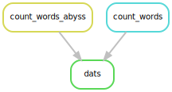

> ## Software modules
>
> Nextflow can be loaded using modules.
> 
> ```
> $ module load nextflow
> ```
> {: .language-bash}
{: .callout}

## main.nf

Create a file, commonly called `main.nf`, containing the following content:

```
#!/usr/bin/env nextflow

wordcount="wordcount.py"
params.query="books/isles.txt"

println "I will count words of $params.query using $wordcount"
```
{: .source}

This `main.nf` file contains the main nextflow script that calls the processes (using channels and operators as
required).  It does not need to be called `main.nf` but is standard practice.


Looking line by line:

```
#!/usr/bin/env nextflow
```
This is required to tell Nextflow it is a nextflow script.

```
wordcount="wordcount.py"
```
This sets a variable to refer to later.

```
params.query="books/isles.txt"
```
This is the query we have to find the number of words.  Can be set with the commandline argument when running `nextflow`
with `--query`.

```
println "I will count words of $params.query using $wordcount"
```
This simply prints to screen using the variable and parameter above.

Running the code with:

```
$ nextflow run main.nf
```
{: .language-bash}

Should produce:

```
N E X T F L O W  ~  version 20.10.0
Launching `main.nf` [sad_mandelbrot] - revision: 43c1e227e3
I will count words of books/isles.txt using wordcount.py
```
{: .output}

A default `work` folder will also appear but will be empty.

> ## Nextflow arguments
>
> Try changing the variables and parameters on the commandline?
>
> > ## Solution
> > The parameter can changed with:
> > ```
> > $ nextflow run main.nf --query "books/abyss.txt"
> > ```
> > {: .language-bash}
> >
> > Note the variable cannot be changed on the commandline.
> {: .solution}
{: .challenge}

## nextflow.config

The `nextflow.config` is a file to set default global parameters for many parts of the nextflow components such as
parameters, process, manifest, executor, profiles, docker, singularity, timeline, report.

Create a `nextflow.config`. For now we will just use the config file to store the parameters.

```
params.query = "books/isles.txt"
params.wordcount = "wordcount.py"
params.outfile = "isles.dat"
params.outdir = "$PWD/out_dir"
```

Update the `main.nf` to remove the parameters and variables and use the values from `nextflow.config` in the `println`.  You should end
up with:

```
#!/usr/bin/env nextflow

println "I will count words of $params.query using $params.wordcount and output to $params.outfile"
```

If this is run again it should output:

```
N E X T F L O W  ~  version 20.10.0
Launching `main.nf` [angry_baekeland] - revision: ad46425e9c
I will count words of books/isles.txt using wordcount.py and output to isles.dat
```
{: .output}

Note we do not need to use the `out_dir` parameter yet.

> ## params format
>
> The `params` in the `nextflow.config` can be formatted as described or using:
> ```
> params {
>   query = "books/isles.txt"
>   wordcount = "wordcount.py"
>   outfile = "isles.dat"
> }
> ```
{: .callout}

## Processes

Processes are what do work in Nextflow scripts.  Processes require code to run, input data and output data (which may be
used in another process).

In this example we want to run the `wordcount.py` code to code the number of words in an input file that creates a file
of word counts.

We will be using example data (the names of the files are used previously).  The example data can be downloaded with:

```
$ curl -O https://raw.githubusercontent.com/ARCCA/intro_nextflow/gh-pages/files/nextflow-lesson.zip
$ unzip nextflow-lesson.zip
$ cd nextflow-lesson
```
{: .language-bash}

Check the code works:

```
$ module load python
$ python3 wordcount.py books/isles.txt isles.dat
```

This should produce a file `isles.dat` with the word counts.

We should now be able to add this process to the `main.nf`.  Copy the `main.nf` if not already there and add the
following:

```
process runWordcount {

  script:
  """
  module load python
  python3 $PWD/wordcount.py $PWD/books/isles.txt isles.dat
  """

}
```

Note the use of `$PWD` to set the fullpath. This is crucial since Nextflow runs the code in another directory.

Run Nextflow again

```
$ nextflow run main.nf
```
{: .language-bash}

And will produce:
```
N E X T F L O W  ~  version 20.10.0
Launching `main.nf` [voluminous_coulomb] - revision: 6c143df13c
I will count words of books/isles.txt using wordcount.py and output to isles.dat
executor >  local (1)
[38/2f5ad5] process > runWordcount [100%] 1 of 1 ✔
```

The `isles.dat` can be found in `work` directory such as:
```
$ tree work
work
└── 62
    └── 9a9d076cc092ed99701282d3ee3e9f
        └── isles.dat
```

The unique directories (using hashes) can be resumed by Nextflow.

Instead of hardcoding the arguments in the process, we can use the params and make sure `$PWD` is being used in 
`nextflow.config`


> ## Adding more parameters
>
> Try adding more parameters to allow `python3` to be called something else.
>
> > ## Solution
> > 
> > Add to `nextflow.config` the parameter `params.app`
> > Change `python` to be `$params.app`
> > ```
> > params.query = "$PWD/books/isles.txt"
> > params.wordcount = "$PWD/wordcount.py"
> > params.outfile = "isles.dat"
> > params.outdir = "$PWD/out_dir"
> > params.app = "python3"
> > ```
> > and the process is modified to be
> > ```
> > $params.app $params.wordcount $params.query $params.outfile
> > ```
> {: .solution}
{: .challenge}

## Adding help functionality

Now that there is a series of arguments to the workflow it is beneficial to be able to print a help message.

In `main.nf` before the process definition the following can be added:

```
def helpMessage() {
  log.info """
        Usage:
        The typical command for running the pipeline is as follows:
        nextflow run main.nf --query \$PWD/books/isles.txt --outfile isles.dat

        Mandatory arguments:
         --query                       Query file count words
         --outfile                     Output file name
         --outdir                      Final output directory

        Optional arguments:
         --app                         Python executable
         --wordcount                   Python code to execute
         --help                        This usage statement.
        """
}

// Show help message
if (params.help) {
    helpMessage()
    exit 0
}
```

And add `params.help` to `nextflow.config` to a default value of `false`.  Test the help functionality with:
```
$ nextflow run main.nf --help
```
{: .language-bash}

We may want to add more dependencies that can be represented as:



You should now be able to run code and change what is run on the command line.  We will now move onto learning about
processes can use inputs and outputs.

