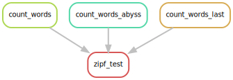

---

title: "Processes and channels"
teaching: 15
exercises: 15
questions:
- "How do I pass information from processes?"
objectives:
- "Understand processes."
- "Understand that channels link processes together."
- "Process more files"
keypoints:
- "Channels and processes are linked, one cannot exist without the other."
---

We have hopefully ran a simple workflow with fixed input and outputs than can be modified on the commandline.  However to use the power of Nextflow, we should investigate further the concept of processes and how its link to the
concept of channels.

## Channels

Channels can act as a **queue** or a **value**.

 * A queue is  *consumable*, that is to say once it uses an entry in the channel it is removed.
 * A value is fixed for the duration of the run, once a channel is loaded with a value it can be used over and over
   again by many processes.

When using **channels** the use of **operators** will be more apparent.  **operators** link channels together or
transform values in channels.  For example we can add a channel to input many files.

```
Channel
  .fromPath(params.query)
  .into{queryFile_ch}
```

Notice the use of methods `(...)` and closures `{...}

We can now add the `channel` as an input inside the process

```
input:
  path(queryFile) from queryFile_ch
```

And change the process to include `$queryFile` instead of `$params.query`.  This will provide no real advantage over the
current code but if we run with an *escaped* wildcard you can process as many files in the directory as required:

```
$ nextflow run main.nf --query $PWD/books/\*.txt
```
{: .bash-language}


The output should now produce:

```
N E X T F L O W  ~  version 20.10.0
Launching `main.nf` [sharp_euclid] - revision: 8594437a09
I will count words of /nfshome/store01/users/c.sistg1/nf_test/nextflow-lesson/books/*.txt using /nfshome/store01/users/c.sistg1/nf_test/nextflow-lesson/wordcount.py and output to isles.dat
executor >  local (4)
[aa/dbc648] process > runWordcount (2) [100%] 4 of 4 ✔
```

Notice the `4 of 4`.  This has run the process 4 times for each of the 4 books we have available.

> ## Output names
>
> Can you see one issue though?  The output file does not change.  We need to provide a sensible output name.  Try looking
> inside the `work` directory.  How does multiple jobs stored?
>
> > ## Solution
> > Each job has its own unique directory.  THerefore no files are overwritten even if each job has the same output
> > name.
> {: .solution}
{: .challenge}

To give the output name something sensible we could use `${queryFile.baseName}.dat` as the output.  Try it and see if it
works and outputs the files in the current directory.

> ## Bioinformatics specific functions
>
> Nextflow was designed from a bioinformatics perspective so there are some useful functions.
> 
> For example splitting a **fasta** file is common practice so can be done with:
> 
> ```
> Channel
>   .frompath(params.query)
>   .splitFasta(by: 1, file:true)
>   .into { queryFile_ch }
> ```
>
> This will split the fasta file into chunks of size 1 and create individual processes for each chunk.  However you will
> need to join these back again.  Nextflow comes to the rescue with:
>
> ```
> output:
>   path(params.outFileName) into blast_output_ch
> ```
> 
> And after the process use the channel
> 
> ```
> blast_output_ch
>   .collectFile(name: 'combined.txt', storeDir: $PWD)
> ```
{: .callout}

## Adding more processes

Back to the book example.  We can now process all the books but what can we do with the results.  There is something
call **Zipf's Law**.  We can use the output from each of the wordcounts from the book to test Zipf's Law.  For example
the following dependency diagram shows what we would like to achieve:



> ## Zipf's Law
>
> [Zipf's Law](https://en.wikipedia.org/wiki/Zipf%27s_law) is an [empirical law](https://en.wikipedia.org/wiki/Empirical_law) formulated 
> using [mathematical statistics](https://en.wikipedia.org/wiki/Mathematical_statistics) 
> that refers to the fact that many types of data studied in the physical and 
> social sciences can be approximated with a Zipfian distribution, one of a family 
> of related discrete [power law](https://en.wikipedia.org/wiki/Power_law) [probability distributions](https://en.wikipedia.org/wiki/Probability_distribution).
>
> Zipf's law was originally formulated in terms of [quantitative linguistics](https://en.wikipedia.org/wiki/Quantitative_linguistics), 
> stating that given some [corpus](https://en.wikipedia.org/wiki/Text_corpus) 
> of [natural language](https://en.wikipedia.org/wiki/Natural_language) utterances, 
> the frequency of any word is [inversely proportional](https://en.wikipedia.org/wiki/Inversely_proportional) 
> to its rank in the [frequency table](https://en.wikipedia.org/wiki/Frequency_table). 
> For example, in the [Brown Corpus](https://en.wikipedia.org/wiki/Brown_Corpus) 
> of American English text, the word the is the most frequently occurring word, 
> and by itself accounts for nearly 7% of all word occurrences (69,971 out of 
> slightly over 1 million). True to Zipf's Law, the second-place word of 
> accounts for slightly over 3.5% of words (36,411 occurrences), followed by 
> and (28,852). Only 135 vocabulary items are needed to account for half 
> the [Brown Corpus](https://en.wikipedia.org/wiki/Brown_Corpus).
> 
> Source: [Wikipedia](https://en.wikipedia.org/wiki/Zipf%27s_law):
{: .callout}

Let's create a new process that runs the Python code to test Zipf's Law.  You cansee what it produces by running it on
the command line.

```
$ python zipf_test.py abyss.dat isles.dat last.dat > results.txt
```
{: .bash-language}

This can be added as a process with:

```
process testZipf {

  '''
  module load python
  python3 zipf_test.py abyss.dat isles.dat last.dat > results.txt
  '''

}
```

However we have to define the inputs.

In the original process the output was just a name, however we can now add the ouput to a channel.  We now do not need
to store the `.dat` output in `$PWD`.  We can leave them in the work directories.  (Remember to change the original
`RunWordcount` process).

```
output:
  path("${queryFile.basenName}.dat") into wordcount_output_ch
```

The input for `testZipf` will use the `collect()` method of the channel:

```
input:
  val x from wordcount_output_ch.collect()
  
  """
  module load python
  python3 zipf_test.py ${x.join(" ")} > $PWD/results.txt
  """
```

Lets run it and see what happens.

```
$ nextflow run main.nf --query $PWD/books/\*.txt
N E X T F L O W  ~  version 20.10.0
Launching `main.nf` [lethal_cuvier] - revision: 4168a6dfe0
I will count words of /nfshome/store01/users/c.sistg1/nf_test/nextflow-lesson/books/*.txt using /nfshome/store01/users/c.sistg1/nf_test/nextflow-lesson/wordcount.py and output to isles.dat
executor >  local (5)
[0c/46bef2] process > runWordcount (2) [100%] 4 of 4 ✔
[13/001d31] process > testZipf         [100%] 1 of 1 ✔
```
{:.output}

This now runs two processes.  Output should be stored in `results.txt` within the current directory.  We should really
store the results in the outdir location defined in params. The `publishDir` directive defines a location to make
available
output from a process.

```
publishdir "$params.outdir"
```

By defining the output for the process it will know to copy the data there.

> ## Configure the output directory
>
> Currently we are just outputting to `$PWD`.  How can this be modified.  Try using the `publishDir` directive in the
> `testZipf` process and define an output file to copy to it.
> > ## Solution
> >
> > We first set `publishDir` to the value in `params`.
> >
> > ```
> > publishDir "$params.outdir"
> > ```
> >
> > Then define an output that will be available in `publishDir`.
> > 
> > ```
> > output:
> >   path('results.txt')
> > ```
> {: .solution}
{: .challenge}

We have now created a very simple pipeline where four processes run in parallel and a process uses all output to create
a results file.  We shall now move to looking closer at the `nextflow.config`.


