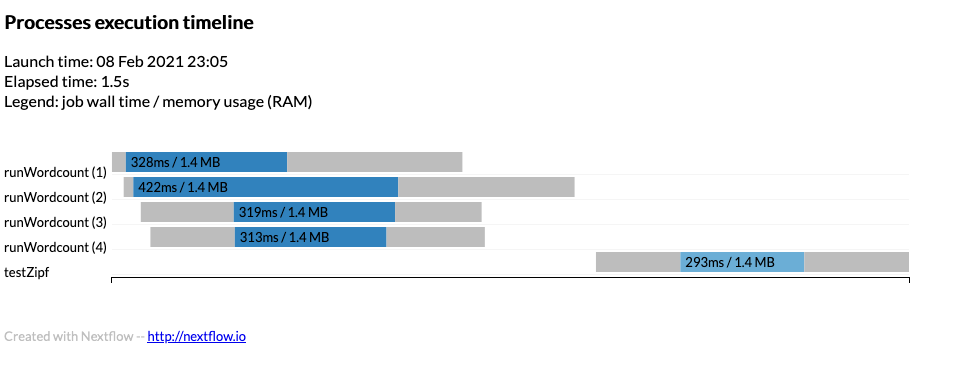

We have got to a point where we *hopefully* have a working pipeline.  There is now some configuration options to allow
us to explore and modify the behaviour of the pipeline.

The `nextflow.config` was used earlier to set parameters for the Nextflow script.  We can also use it to set a number of
different options.

## Timeline

To obtain a detailed timeline report add the following to the `nextflow.config`

```
timeline {
  enabled = true
  file = "$params.outdir/timeline.html"
}
```
{: .source}

Notice the user of `$params.outdir` that can be defined in the `params` section to a default value such as
`$PWD/out_dir`.

The timeline will look something like:



Example timeline can be found [timeline.html]({{site.url}}{{site.baseurl}}/files/lesson_template/examples/timeline.html)

## Report

A detailed execution report can be created using:

```
report {
  enabled = true
  file = "$params.outdir/report.html"
}
```
{: .source}

Example can be found [report.html]({{site.url}}{{site.baseurl}}/files/lesson_template/examples/report.html)

## Executors

If we are using a job scheduler where user limits are in place we can define thise to stop Nextflow abusing the
scheduler.  For example to report the queueSize as 100 and submit 1 job every 10 seconds we would define the `executor`
block as:

```
executor {
  queueSize = 100
  submitRateLimit = '10 sec'
}
```
{: .source}

## Profiles

To use the `executor` block as described previously then a profile can be used to define a job scheduler.  Within the
`nextflow.config` file define:

```
profiles {
  slurm { includeConfig './configs/slurm.config' }
}
```
{: .source}

and within the `./configs/slurm.config` define the Slurm settings to use:

```
process {
  executor = 'slurm'
  clusterOptions = '-A scwXXXX'
}
```
{: .source}

Where `scwXXXX` is the project code to use.

This can be used on the command line:

```
$ nextflow run main.nf -profile slurm
```
{: .language-bash}

Or the whole definition can be defined within the process we can define the `executor` and `cpus`

```
  executor='slurm'
  cpus=2
```
{: .source}

You can also define the profile on the command line but add to existing profile such as using `-profile slurm` when
running but setting `cpus = 2` in the process.  Note for MPI codes you would need to put `clusterOptions = '-n 16'` for
a 16 tasks to use for MPI.  Be careful not to override options such as `clusterOptions` that define the project code.

## Manifest

A manifest can describe the workflow and provide a Github location.  For example
```
manifest {
  name = 'ARCCA/intro_nextflow_example'
  author = 'Thomas Green'
  homePage = 'www.cardiff.ac.uk/arcca'
  description = 'Nextflow tutorial'
  mainScript = 'main.nf'
  version = '1.0.0'
}
```
{: .source}

Where the `name` is the location on Github and `mainScript` is the location of the file (default in `main.nf`).

Try:

```
$ nextflow run ARCCA/intro_nextflow_example --help
```
{: .language-bash}

To update from remote locations you can run:

```
$ nextflow pull ARCCA/intro_nextflow_example
```
{: .language-bash}

To see existing remote locations downloaded:

```
$ nextflow list
```
{: .language-bash}

Finally, to print information about remote you can:

```
$ nextflow info ARCCA/intro_nextflow_example
```
{: .language-bash}

## Labels

Labels allow to select what the process can use from the `nextflow.config` or in our case the options in the Slurm
profile in `./configs/slurm.config`

```
process {
  executor = 'slurm'
  clusterOptions = '-A scw1001'
  withLabel: python { module = 'python' }
}
```
{: .source}

Defining a process with the above `label 'python'` and will load the `python` module.

## Modules

Modules can also be defined in the process (rather than written in the script) with the `module` directive.

```
process doSomething {
  module = 'python'
  """
  python3 --version
  """
}
```
{: .source}

## Generate DAG

From the command line a Directed acyclic graph (DAG) can show the dependencies in a nice way.  Run `nextflow` with:

```
$ nextflow run main.cf -with-dag flowchart.png
```
{: .language-bash}

The `flowchart.png` will be created and can be viewed.

Hopefully the following page has helped you understand the options to dig deeper into your pipeline and maybe make it
more portable by using labels to select what to do on a platform.  Lets move onto running Nextflow on Hawk.


